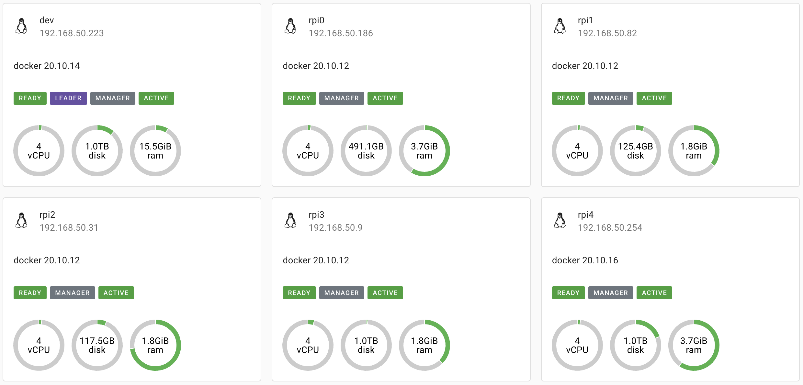

# Server service configs and tools

## Description

This repository contains configuration (docker-compose.yml files) to set up the services I run on my home server. As well as, some useful scripts in the `./scripts` directory.

## Service configs

I currently use the following services on my home server.

| Service              | Purpose                                                   |
|----------------------|-----------------------------------------------------------|
| Drone CI and runners | CI/CD                                                     |
| Droppy               | File storage                                              |
| Resilio Sync         | Real-time peer to peer syncing                            |
| Swarmpit             | Monitor resources                                         |
| Traefik              | Reverse proxy                                             |

## Current nodes in the Swarm cluster

## Scripts

### `backup.sh`

Make backups of important directories into tarballs.

### `update_container.sh`

Update redeploy (update) containers.

### `force_rebalance.sh`

Simply force a rebalance of the Swarm on all the services.

Should not be run too often and only manually when necessary.

### `ddns-start`

Modified version of @alphabt's project [asuswrt-merlin-ddns-cloudflare](https://github.com/alphabt/asuswrt-merlin-ddns-cloudflare) to suit my usage.

More reference: <https://gist.github.com/dd-han/09853f07efdf67f0f4af3f7531ac7abf>

### `start_pfsense.sh`

Starts the headless virtualbox.

Was used previously when I was running pfSense in a virtualbox as the router.

### `get_dhcp.sh`

Assures the enp2s0 interface has a local IP.
